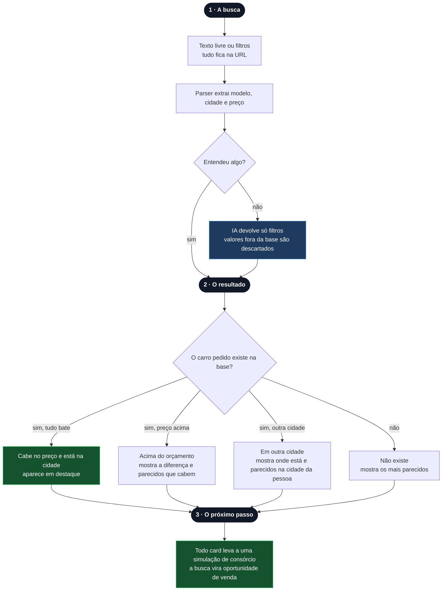

# Buscador de Carros

Este documento conta o projeto do começo ao fim: o que o desafio pedia, o que estava em jogo para o negócio, como as decisões foram tomadas, a arquitetura que saiu delas e o que foi sendo construído. Ele é atualizado a cada etapa e serve de base para o README final.

## O Desafio

O desafio técnico da Klubi pede uma aplicação para buscar carros à venda, usando como base de dados um JSON fornecido por eles. Pode ser uma aplicação web ou um agente de IA, e o que mais pesa na avaliação é a experiência de quem busca.

A avaliação passa por três cenários:

1. Procurar um carro que existe no JSON.
2. Procurar um carro que existe, mas com um valor abaixo do disponível.
3. Procurar um carro que existe, mas em outra localidade.

Nos dois últimos, o enunciado deixa claro o que espera: convencer a pessoa a comprar mesmo assim, seja com sugestões parecidas, filtros ajustáveis ou uma IA que entenda a intenção da busca.

Os diferenciais são uso de IA, deploy na nuvem, cuidado com design e usabilidade, e organização de código e commits. A entrega é um repositório público com um README que explique como rodar, mostre o funcionamento, justifique as decisões e responda a uma seção obrigatória de Plano de Negócios.

## O Que Está em Jogo

A Klubi é uma administradora de consórcio digital, e o consórcio de carros cobre créditos de R$ 50 mil a R$ 200 mil. Todos os carros da base, de R$ 68.990 a R$ 122.000, cabem nessa faixa.

Para uma empresa assim, um buscador de carros não é o produto. É a porta de entrada. Quem busca um carro está a poucos passos de uma decisão de compra grande, e esse é o melhor momento para apresentar uma forma de pagar por ela. O buscador funciona quando a pessoa sai dele com um próximo passo, e não só quando ela encontra o carro.

Isso muda a leitura dos casos de teste. Os casos 2 e 3 são exatamente onde um marketplace comum perde o cliente: o carro é caro demais ou está longe demais. E são justamente os casos em que a Klubi tem o melhor argumento. O consórcio transforma o preço em mensalidade, e a carta de crédito compra o carro onde ele estiver.

## Como as Decisões Foram Tomadas

A primeira proposta foi Next.js na Vercel com a API do Claude interpretando toda busca. Ela resolvia o problema, mas colocava um custo variável em cada busca: quanto mais o produto crescesse, maior a conta, e a margem por usuário encolheria junto com o sucesso. Além disso, o produto ficaria fora do ar sempre que o provedor de IA ficasse.

A pergunta que mudou o desenho foi se a IA precisava estar no caminho principal. Com 10 carros e 6 cidades, quase tudo que alguém digitaria cabe num parser simples: preço ("100 mil", "até 90k"), cidade ("SP", "sampa") e modelo. Esse caminho não tem custo por busca, responde na hora e pode ser testado. A IA ficou para o que o parser não entende, como "algo econômico pra família". Assim, só uma parte das buscas gera custo de IA, e o custo por usuário continua baixo mesmo com o volume crescendo, o que protege a margem. A resposta imediata também pesa na conversão: quem espera menos pelo resultado desiste menos. O provedor de IA não fica preso ao código: qualquer serviço compatível com a API de chat da OpenAI serve, e trocar de provedor é trocar três variáveis de ambiente. Assim, a empresa pode escolher sempre o de menor custo por chamada, e uma mudança de preço de um fornecedor não vira reescrita de código.

A segunda mudança veio de olhar os dados. Com só marca, modelo, preço e cidade, "carro parecido" significaria apenas "preço próximo", e a sugestão para quem procura um Dolphin elétrico seria um Kwid. Uma recomendação ruim é pior do que nenhuma, porque ensina a pessoa a ignorar as próximas. Por isso a base ganhou dois campos, categoria e combustível.

A terceira veio de entender quem é a Klubi. Se o buscador existe para levar pessoas ao consórcio, todo card precisa ter um caminho até ele.

A regra geral foi resolver primeiro o que o desafio pede, do jeito mais simples que funcione, e só depois acrescentar o que aumenta a chance de a busca virar uma venda.

## Visão Geral

## A Base

O `data/cars.json` traz 10 carros com `Name`, `Model`, `Image`, `Price` e `Location`:

- **Preços:** de R$ 68.990 (Renault Kwid) a R$ 122.000 (Jeep Renegade).
- **Cidades:** metade dos carros está em São Paulo. Campinas, Rio de Janeiro, Belo Horizonte, Curitiba e Porto Alegre têm um carro cada.
- **Imagens:** todas apontam para `exemplo.png`.

Os campos originais ficaram como estavam. Entraram só dois campos novos, que é o mínimo para "parecido" fazer sentido:

| Carro | `Category` | `Fuel` |
|---|---|---|
| BYD Dolphin | hatch | elétrico |
| Toyota Corolla | sedan | flex |
| Volkswagen T-Cross | suv | flex |
| Honda Civic | sedan | gasolina |
| Chevrolet Onix | hatch | flex |
| Hyundai HB20 | hatch | flex |
| Renault Kwid | hatch | flex |
| Fiat Pulse | suv | flex |
| Jeep Renegade | suv | flex |
| Peugeot 208 | hatch | flex |

As imagens foram trocadas por fotos reais de cada modelo. Num anúncio de carro, a foto é o primeiro argumento de venda, e o próprio desafio pede isso. Elas ficam salvas em `public/cars/`, para que nenhum link externo quebre na frente de quem está decidindo.

## A Busca

A pessoa pode digitar livremente ("Dolphin em SP por uns 100 mil") ou ajustar os filtros de modelo, cidade e preço máximo. Os dois caminhos levam ao mesmo lugar: filtros na URL. Assim, a busca pode ser compartilhada, e quem manda o link para alguém da família traz um segundo interessado sem custo de aquisição.

O parser trabalha sobre o texto em minúsculas e sem acento, e procura:

- **Preço:** um número seguido ou não de "mil" ou "k", ou precedido de "R$". "Até" vira teto rígido. Sem "até", o valor é tratado como aproximado e aceita até 10% acima, porque quem diz "uns 100 mil" não descarta um carro de R$ 100.500. Um número solto só vira preço se tiver cara de preço, porque "208" é um modelo, não um orçamento.
- **Cidade:** o nome da cidade ou um apelido comum ("SP", "sampa", "rio", "bh", "poa").
- **Modelo e marca:** o nome como está na base, apelidos como "VW" e erros de digitação comuns ("dolfin", "t cross", "hb 20").
- **Categoria e combustível:** "SUV", "sedã", "hatch", "elétrico", "flex".

O que o parser entendeu aparece nos filtros, então a pessoa vê a interpretação e corrige se precisar. Cada busca mal entendida é um cliente que vai embora achando que o carro não existe.

## Os Três Casos de Teste

O resultado nunca é uma lista vazia, porque uma lista vazia é o fim da conversa com o cliente. Os carros são ordenados, e não filtrados: primeiro o que a pessoa pediu, depois os parecidos, que são os da mesma categoria, na mesma cidade e dentro do orçamento, nessa ordem de prioridade.

O carro pedido continua visível mesmo quando não serve. Ele é a referência do que a pessoa quer, e esconder esse carro seria desistir da venda dele antes da hora.

| Caso | Exemplo de busca | O que a tela mostra | Por que isso vende |
|---|---|---|---|
| 1. O carro existe | "BYD Dolphin em SP por uns 100 mil" | O Dolphin em destaque, com o caminho para simular o consórcio | A pessoa encontrou o que queria; o trabalho agora é não atrapalhar |
| 2. Valor abaixo do disponível | "Dolphin até 80 mil" | O Dolphin marcado "R$ 19.990 acima do seu orçamento" e, logo abaixo, os hatches que cabem nos R$ 80 mil, como o HB20 em SP | Ela vê dois caminhos: um carro parecido que cabe hoje ou o carro que ela quer, pago em mensalidades |
| 3. Outra localidade | "Civic em São Paulo" | O Civic marcado "disponível no Rio de Janeiro" e, logo abaixo, os sedans em São Paulo, como o Corolla | A distância deixa de ser o motivo para desistir: há um sedan perto, e a carta de crédito compra o carro onde ele estiver |

Se o modelo pedido não existir na base, a tela diz isso e mostra os mais parecidos pelo que mais foi possível entender da busca, como a categoria ou a faixa de preço.

## A Tela

Uma página só: a busca no topo, os filtros logo abaixo e os resultados em cards com foto, nome, preço, cidade e o botão para simular o consórcio daquele carro.

- **Responsiva desde o início.** A maior parte das buscas por carro acontece no celular, então o layout é pensado primeiro para uma coluna e se abre em grade nas telas maiores.
- **Feedback de carregamento.** Enquanto a IA responde, a lista mostra um esqueleto dos cards no lugar de uma tela parada, que é o momento em que as pessoas fecham a aba. Sem IA, o resultado é imediato.
- **Acessível.** Campos com rótulo, fotos com texto alternativo e navegação por teclado. Acessibilidade também é alcance: ninguém fica de fora do funil.

## A IA

A IA só é chamada quando o parser não entende nada da busca. Ela recebe o texto e a lista de valores que existem na base, e devolve apenas filtros em JSON: modelo, cidade, categoria, combustível e preço máximo. O servidor descarta qualquer valor que não esteja na base, então uma resposta errada vira, no pior caso, um filtro que a pessoa corrige.

A chamada tem temperatura 0 e um limite de alguns segundos. Se o provedor de IA falhar, demorar ou não estiver configurado, a busca segue só com o parser. Uma falha do fornecedor não derruba a vitrine.

Abaixo da busca ficam sugestões clicáveis, como "SUV econômico em SP" e "um elétrico pra cidade". Elas mostram o que dá para digitar, tiram a pessoa da tela em branco e caem justamente no caminho da IA. Quando a IA contribui com um filtro, ele aparece marcado como interpretado por IA.

## Segurança

Os cuidados de segurança se concentram na IA, porque é onde estão o risco financeiro e o risco de marca:

- **A chave da IA fica só no servidor**, em variável de ambiente da Vercel, e nunca vai para o repositório. Uma chave vazada é uma conta que outra pessoa usa e a empresa paga.
- **A resposta da IA nunca é exibida.** Ela só vira filtro, e só se o valor existir na base. Todo texto que a pessoa lê sai de um template. Uma instituição regulada pelo Banco Central não pode correr o risco de uma IA prometer um preço ou uma condição que não existe.
- **O texto da busca tem tamanho máximo**, e a conta do provedor de IA deve operar com saldo pré-pago ou limite de gasto, o que coloca um teto no custo mesmo em caso de abuso.

## Onde Roda

Next.js com TypeScript e Tailwind, publicado na Vercel. O `cars.json` vai junto no build. As únicas variáveis de ambiente são as do provedor de IA, `AI_API_URL`, `AI_API_KEY` e `AI_MODEL`, e elas são opcionais.

O parser e a ordenação dos resultados têm testes que cobrem os três casos de teste, porque é ali que o desafio é decidido.

O código fica separado por responsabilidade: a base, o parser, a ordenação, a chamada à IA e a interface, cada um no seu arquivo. Os commits seguem o Conventional Commits, com uma mudança por commit. Quem assumir o projeto depois entende o histórico sem precisar perguntar.

## Detalhes Que Vendem o Carro

Com o desafio resolvido, estas são as melhorias candidatas. Cada uma só entra se aumentar a chance de a busca virar uma venda:

- **Mensalidade do consórcio no caso 2:** trocar "R$ 19.990 a mais" por uma mensalidade estimada, que a pessoa compara com o próprio salário. As premissas do cálculo ficam escritas no card, e o valor final vem da simulação oficial.
- **Distância no caso 3:** mostrar "≈ 360 km" em vez de só o nome da cidade.
- **Microinterações:** transições suaves ao trocar filtros e ao reordenar os cards.

## Como Saber se Está Funcionando

Um buscador para uma empresa de consórcio se mede pelo que acontece depois da busca. Quatro números bastam para saber se ele cumpre o papel:

- **Cliques em "simular consórcio" por busca:** a conversão que importa.
- **Cliques em alternativas nos casos 2 e 3:** mostram se as sugestões convencem ou só ocupam espaço.
- **Buscas por modelos que não existem na base:** demanda real, que indica o que vale a pena ter no catálogo.
- **Buscas que precisaram da IA:** mostram o que o parser ainda não entende e onde vale a pena ensiná-lo, trocando custo por busca por código.

## O Que Ficou de Fora

Algumas ideias trariam resultado para o negócio, mas dependem de coisas que um desafio técnico não tem: dados reais, acesso aos sistemas da Klubi ou tráfego de verdade. Elas ficaram de fora desta versão, e não por falta de valor.

- **Simulação oficial dentro do card.** Mostrar a mensalidade real, calculada pelo sistema da Klubi, no lugar de uma estimativa. É o número que decide a compra, e cada clique a menos até ele aumenta a conversão. Ficou de fora porque depende de acesso à API de simulação.
- **Comparação entre consórcio e financiamento.** Mostrar, no mesmo carro, quanto a pessoa paga no total em cada modalidade. É o argumento mais forte da Klubi, porque o consórcio não tem juros. Ficou de fora porque exige taxas reais dos dois lados para não virar promessa sem base.
- **"Me avise quando chegar".** Quando o carro não existe na base, ou não cabe no orçamento, a pessoa deixa o contato para ser avisada. A busca frustrada vira um contato qualificado, com o carro e a faixa de preço que ela quer. Ficou de fora porque guardar dados pessoais exige consentimento, armazenamento e cuidados de LGPD que vão além do desafio.
- **Alertas de preço e de novos carros.** Trazem a pessoa de volta sem gastar com mídia, o que reduz o custo de aquisição e sustenta a retenção. Dependem do cadastro acima.
- **Catálogo real, vindo de parceiros.** Com milhares de carros, o buscador deixa de ser vitrine e vira produto, e aí busca semântica e recomendações personalizadas passam a compensar o custo. Com 10 carros fictícios, seriam só custo.
- **Teste A/B das mensagens dos casos 2 e 3.** Descobrir qual frase converte mais, por exemplo "R$ 19.990 acima do orçamento" ou "a partir de R$ X por mês". Precisa de tráfego real para dar resultado confiável.

## Mapa dos Requisitos

| Requisito do desafio | Onde é atendido | Status |
|---|---|---|
| Buscar e visualizar carros de forma intuitiva | A Busca, A Tela | ✅ |
| Usar o JSON fornecido | A Base | ✅ |
| Atualizar as imagens | A Base, Créditos das Imagens | ✅ |
| Caso 1: o carro existe | Os Três Casos de Teste | ✅ |
| Caso 2: valor abaixo do disponível | Os Três Casos de Teste | ✅ |
| Caso 3: outra localidade | Os Três Casos de Teste | ✅ |
| Diferencial: IA | A IA | ⏳ |
| Diferencial: deploy na nuvem | Onde Roda | ⏳ |
| Diferencial: design e usabilidade | A Tela, Detalhes Que Vendem o Carro | ⏳ |
| Diferencial: organização de código e commits | Onde Roda | ⏳ |
| Repositório público | A Entrega | ⏳ |
| README: como rodar, funcionamento, decisões | A Entrega | ⏳ |
| README: Plano de Negócios | A Entrega, O Que Está em Jogo | ⏳ |

## A Entrega

O repositório é público, e o README final reúne o que o desafio pede:

- **Como rodar:** instalar, configurar o `.env` opcional da IA e iniciar.
- **Funcionamento:** o link do deploy na Vercel, com uma busca pronta para cada um dos três casos de teste.
- **Decisões técnicas e de experiência:** um resumo deste documento.
- **Plano de Negócios:** modelo de negócio, aquisição dos primeiros usuários, CAC, LTV, monetização e retenção, partindo da leitura em O Que Está em Jogo.

## Créditos das Imagens

As fotos vêm do Wikimedia Commons, com licenças que permitem uso comercial desde que a autoria seja creditada. Uma foto sem licença clara seria um risco jurídico para a empresa, por menor que fosse o projeto.

| Carro | Versão na foto | Autor | Licença | Fonte |
|---|---|---|---|---|
| BYD Dolphin | Dolphin 2024 | RL GNZLZ | CC BY-SA 2.0 | [Wikimedia Commons](https://commons.wikimedia.org/wiki/File:BYD_Dolphin_2024.jpg) |
| Toyota Corolla | 2.0 XEi 2023 | Just a Man | CC BY 4.0 | [Wikimedia Commons](https://commons.wikimedia.org/wiki/File:2023_Toyota_Corolla_2.0_XEi_(Brazil).jpg) |
| Volkswagen T-Cross | 170 TSI Trendline 2022 | RL GNZLZ | CC BY-SA 2.0 | [Wikimedia Commons](https://commons.wikimedia.org/wiki/File:Volkswagen_T-Cross_170_TSi_Trendline_2022.jpg) |
| Honda Civic | Touring 1.5 Turbo 2017 | JasonVogel | CC BY-SA 4.0 | [Wikimedia Commons](https://commons.wikimedia.org/wiki/File:Brazilian_Honda_Civic_touring_2017_(cropped).jpg) |
| Chevrolet Onix | RS 2020 | NaBUru38 | CC BY-SA 4.0 | [Wikimedia Commons](https://commons.wikimedia.org/wiki/File:Chevrolet_Onix_Mk2_RS_2020_in_Maldonado_-_front.jpg) |
| Hyundai HB20 | 1.0 T-GDi Platinum Plus 2023 | Autosdeprimera | CC BY 3.0 | [Wikimedia Commons](https://commons.wikimedia.org/wiki/File:2023_Hyundai_HB20_1.0_T-GDi_Platinum_Plus_(Brazil)_front_view.png) |
| Renault Kwid | 1.0 Life 2021 | RL GNZLZ | CC BY-SA 2.0 | [Wikimedia Commons](https://commons.wikimedia.org/wiki/File:2021_Renault_Kwid_1.0_Life.jpg) |
| Fiat Pulse | 1.0 Turbo 200 Audace 2024 | Just a Man | CC BY 4.0 | [Wikimedia Commons](https://commons.wikimedia.org/wiki/File:2024_Fiat_Pulse_1.0_Turbo_200_Audace_(front).jpg) |
| Jeep Renegade | versão brasileira, antes da reestilização | JasonVogel | CC BY-SA 4.0 | [Wikimedia Commons](https://commons.wikimedia.org/wiki/File:Brazilian_Jeep_Renegade.jpg) |
| Peugeot 208 | 1.6 Feline 2020 | Garagem do Jabulas | CC BY 3.0 | [Wikimedia Commons](https://commons.wikimedia.org/wiki/File:2020_Peugeot_208_1.6_EC5_VTi_Feline_(built_in_Argentina).png) |

## Andamento

Esta seção é o diário do projeto. Cada etapa entra aqui quando termina, com o que foi feito e o que mudou em relação ao plano.

### 2026-09-28: Arquitetura

A arquitetura acima foi escrita antes de qualquer código, para que cada etapa seguinte tenha um critério claro de pronto.

### 2026-09-28: Scaffold

O projeto foi criado com Next.js 16, TypeScript, Tailwind 4 e ESLint, usando o App Router. O conteúdo de exemplo do template saiu, a página ficou em português e com título e descrição do produto. Lint e build passam sem erros.

### 2026-09-28: Base e imagens

O `cars.json` ganhou os campos `Category` e `Fuel`, no mesmo padrão de nomes dos campos originais, e o `Image` de cada carro passou a apontar para uma foto real em `public/cars/`. As fotos foram escolhidas pelo mesmo critério de um anúncio: o carro de frente, em três quartos e sem nada cortado, e sempre na versão vendida no Brasil. Uma foto de versão estrangeira mostra um carro que a pessoa não vai encontrar na concessionária, e um anúncio que não bate com o carro de verdade quebra a confiança no momento da compra. O Civic com foto livre disponível é o Touring, que é movido a gasolina, então o `Fuel` dele segue a foto.

### 2026-09-28: Parser e ordenação

O entendimento da busca e a ordenação dos resultados ficaram em funções puras, separadas da interface: `lib/parse.ts` transforma o texto em filtros e `lib/rank.ts` ordena a base a partir deles. Como não dependem de tela nem de servidor, os três casos de teste do desafio viraram testes automatizados em `lib/search.test.ts`, rodando com o executor de testes nativo do Node, sem nenhuma dependência nova. Se uma mudança futura quebrar um dos casos que a Klubi vai avaliar, o teste acusa antes do deploy.

Os testes cobrem também o que protege a conversão: nenhuma busca termina em lista vazia, e um número de modelo como "208" não é confundido com orçamento.

Eu costumo trabalhar com TDD, escrevendo o teste antes do código. Aqui não foi assim: com o prazo curto do desafio, os testes vieram junto com a implementação, e o esforço foi concentrado em cobrir os casos que decidem a avaliação em vez de cada detalhe do parser.

### 2026-09-28: Interface

A página ficou em um arquivo de rota e quatro componentes: a barra de busca, os filtros, o card do carro e um seletor que aplica o filtro assim que a pessoa escolhe. Busca e filtros são formulários GET, então tudo vive na URL: a busca pode ser compartilhada, o botão de voltar funciona e a página responde mesmo antes do JavaScript carregar.

Os filtros já vêm preenchidos com o que o parser entendeu do texto, e o que a pessoa ajusta neles vence o texto. Os valores que chegam pela URL são conferidos contra a base antes de virar filtro, então um parâmetro inventado é simplesmente ignorado. Isso também ganhou teste.

Cada caso de teste tem a sua mensagem no topo dos resultados, e o carro pedido aparece em destaque, com foto grande, mesmo quando não cabe no orçamento ou está em outra cidade. Os parecidos vêm logo abaixo, e cada card mostra em etiquetas por que está ali: mesma categoria, cabe no orçamento, na sua cidade ou quanto passa do orçamento. Todo card termina no botão de simular o consórcio. Abaixo da busca, exemplos clicáveis mostram o que dá para digitar, e o rodapé leva aos créditos das fotos.

O visual segue uma linha monocromática e sóbria, com cor reservada para as etiquetas, porque num anúncio de carro quem precisa aparecer é o carro. A tela foi conferida no desktop e no celular.

### Próximas Etapas

1. Integração com a IA e sugestões clicáveis
2. Deploy na Vercel
3. README final com o link do deploy, decisões e Plano de Negócios
